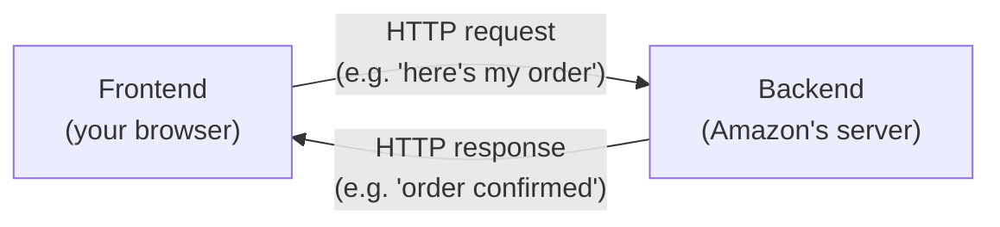
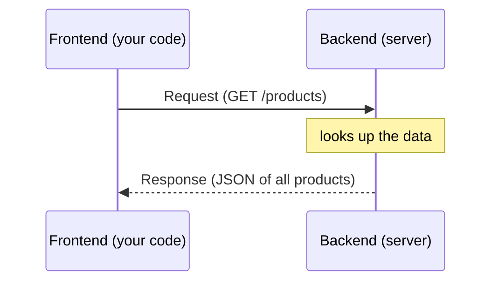
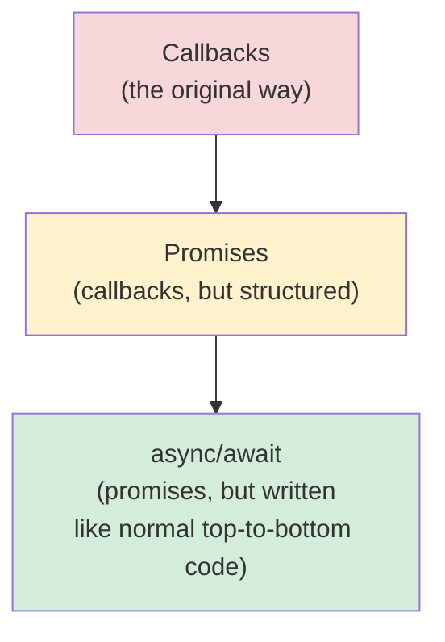
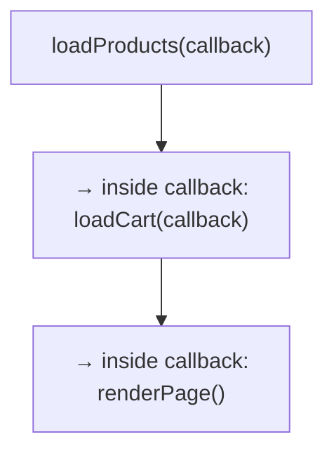
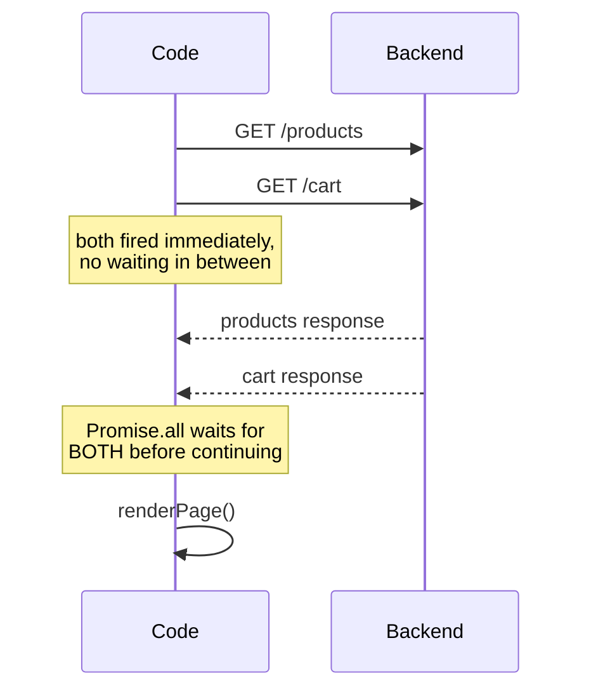
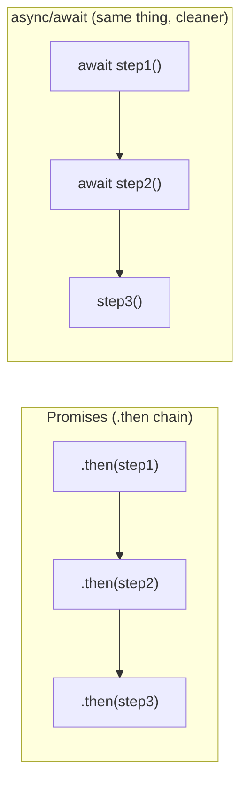
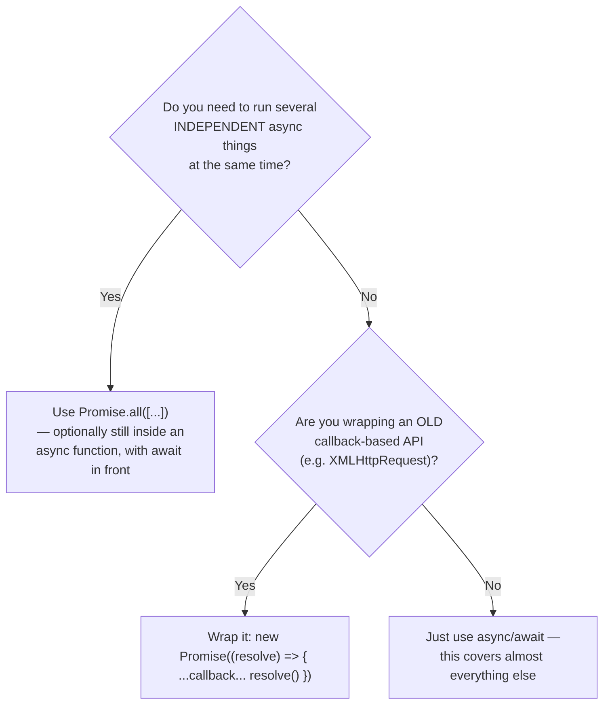
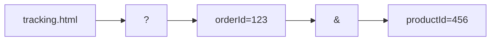

# Milestone 6 — Backend & Asynchronous Programming

Covers lesson 18 (the final lesson of the course): what a backend is, talking to one over HTTP, and the three ways JavaScript handles "this will finish later" code — callbacks, promises, and async/await. Since these three are easy to mix up, this file leans extra hard on **side-by-side comparisons and diagrams** to make the differences click.

## Contents

1. [What Is a Backend?](#1--what-is-a-backend)
2. [Talking to a Backend: HTTP, Requests & Responses](#2--talking-to-a-backend-http-requests--responses)
3. [The Big Picture: Callbacks vs. Promises vs. Async/Await](#3--the-big-picture-callbacks-vs-promises-vs-asyncawait)
4. [Callbacks — the Original Way](#4--callbacks--the-original-way)
5. [Promises — a Cleaner Way to Chain Steps](#5--promises--a-cleaner-way-to-chain-steps)
6. [Async/Await — Promises in Disguise](#6--asyncawait--promises-in-disguise)
7. [`async` vs. `await` — Not the Same Thing](#7--async-vs-await--not-the-same-thing)
8. [`fetch` — the Modern Way to Make Requests](#8--fetch--the-modern-way-to-make-requests)
9. [Error Handling](#9--error-handling)
10. [Testing Asynchronous Code](#10--testing-asynchronous-code)
11. [URL Parameters](#11--url-parameters)
12. [Applying All of This to the Amazon Project](#12--applying-all-of-this-to-the-amazon-project)

---

# 1 — What Is a Backend?

- **Frontend** = the webpage you see and click on (your computer).
- **Backend** = a _second_ computer, owned by the company, that stores and manages the real data (e.g. "what did this customer actually order?").



The two computers talk using **HTTP** (HyperText Transfer Protocol). Every HTTP message you send is attached to a **URL** — an internet "address" telling the browser _which_ backend computer to talk to, e.g. `https://super-simple-backend.dev`.

---

# 2 — Talking to a Backend: HTTP, Requests & Responses

## The request/response cycle

Every single HTTP interaction is exactly **one request → one response**. Never more, never less, per call.



## URL paths = different "questions" to the same backend

The part of the URL after the domain name is the **URL path** — it decides _what_ you're asking for:

| URL                                                 | What you get back   |
| --------------------------------------------------- | ------------------- |
| `https://super-simple-backend.dev/hello`            | plain text          |
| `https://super-simple-backend.dev/products`         | JSON (product list) |
| `https://super-simple-backend.dev/documentation`    | HTML (a web page)   |
| `https://super-simple-backend.dev/images/apple.jpg` | an image            |
| `https://super-simple-backend.dev/not-supported`    | an **error**        |

The full list of URL paths a backend supports is called its **API** (Application Programming Interface) — literally "the ways you're allowed to interact with it."

## Status codes — did it work?

Every response comes with a **status code**:

| Starts with | Meaning                                            |
| ----------- | -------------------------------------------------- |
| **2xx**     | Success                                            |
| **4xx**     | _Your_ problem (bad request, wrong URL path, etc.) |
| **5xx**     | _Their_ problem (server crashed, etc.)             |

## Request types (verbs)

| Verb     | Meaning             | Used for                                  |
| -------- | ------------------- | ----------------------------------------- |
| `GET`    | "Give me something" | Reading data (e.g. load the products)     |
| `POST`   | "Create something"  | Submitting new data (e.g. place an order) |
| `PUT`    | "Update something"  | Editing existing data                     |
| `DELETE` | "Remove something"  | Deleting data                             |

> `GET` requests can't easily carry data _to_ the backend — that's what `POST`/`PUT` are for (see the Amazon order example later).

## Sending a request with `XMLHttpRequest` (the original way)

```js
const xhr = new XMLHttpRequest();

xhr.addEventListener("load", () => {
  console.log(xhr.response); // only available once the response has loaded!
});

xhr.open("GET", "https://super-simple-backend.dev/products");
xhr.send();
```

- `xhr.send()` is **asynchronous** — it fires the request and immediately moves to the next line, _without_ waiting for a reply.
- That's why you **must** set up the `'load'` event listener _before_ calling `.send()` — same logic as attaching a click listener before the click happens.
- `xhr.response` only has real data once the `'load'` event has fired.

---

# 3 — The Big Picture: Callbacks vs. Promises vs. Async/Await

Before going deep on each one, here's the one-paragraph version:

> All three are just **different syntaxes for the exact same idea**: "run this code, but don't block the rest of the program while you wait for a slow operation (like a network request) to finish." They are **not three competing technologies** — promises are _built on_ callbacks, and async/await is just _easier-to-read syntax_ for promises underneath.



## Quick comparison table

|                                   | Callbacks                                                                                   | Promises                                                                                    | Async/Await                                                                 |
| --------------------------------- | ------------------------------------------------------------------------------------------- | ------------------------------------------------------------------------------------------- | --------------------------------------------------------------------------- |
| **What it is**                    | Pass a function to run later                                                                | An object representing "a value that will exist eventually"                                 | Special syntax (`async`/`await`) that makes promise code _look_ synchronous |
| **How you "wait"**                | Nest a function inside the callback                                                         | Chain `.then()`                                                                             | Write `await` in front of the call                                          |
| **Multiple steps**                | Callback inside callback inside callback → deep nesting ("callback hell" / pyramid of doom) | `.then().then().then()` — stays flat                                                        | Just write line after line, like normal code                                |
| **Error handling**                | A separate error callback, or an `error` parameter                                          | `.catch()`                                                                                  | `try { ... } catch (error) { ... }`                                         |
| **Readability**                   | Gets messy fast with multiple steps                                                         | Better, but still has boilerplate (`new Promise`, `resolve`, `.then`)                       | Cleanest — reads top-to-bottom like regular code                            |
| **When you'll actually write it** | Rarely by choice today; still used by some older APIs (like `XMLHttpRequest`)               | When you need `Promise.all`, or you're writing a function that _wraps_ a callback-based API | **The default choice** for new code                                         |

**Practical rule of thumb used throughout this course:** _prefer async/await._ Reach for promise syntax directly (`new Promise`, `.then`, `Promise.all`) only when you're (a) wrapping an old callback-based API into a promise, or (b) running multiple independent async operations at once with `Promise.all`. You'll basically never write raw callback-nesting code by choice once promises/async-await are available — `XMLHttpRequest` is the one place in this course that still uses it, because it predates promises.

---

# 4 — Callbacks — the Original Way

A **callback** is simply a function you hand to another function, to be "called back" (run) later, once something finishes.

```js
function loadProducts(callback) {
  const xhr = new XMLHttpRequest();

  xhr.addEventListener("load", () => {
    const productsData = JSON.parse(xhr.response);
    callback(productsData); // "calling back" once data is ready
  });

  xhr.open("GET", "https://super-simple-backend.dev/products");
  xhr.send();
}

loadProducts((productsData) => {
  console.log(productsData); // runs only after the response arrives
});
```

## The problem: nesting ("callback hell")

The moment you need **multiple** sequential async steps, each one has to be nested _inside_ the previous one's callback — because that's the only place you know the previous step has finished:



```js
loadProducts(() => {
  loadCart(() => {
    renderPage(); // <- three levels deep just to do 3 things in order
  });
});
```

Every additional async step adds **one more layer of indentation**. With 5 or 6 steps, the code becomes an unreadable staircase — this specific problem (deep nesting from sequential callbacks) is exactly what **promises** were invented to fix.

---

# 5 — Promises — a Cleaner Way to Chain Steps

A **promise** is an object representing a value that doesn't exist _yet_ but will (or will fail to) exist in the future. Think of it like a restaurant pager: you don't have your food yet, but you have something ("the promise of food") that will buzz when it's ready.

## Creating one

```js
const promise = new Promise((resolve) => {
  // this code runs immediately
  loadProducts(() => {
    // ...once done...
    resolve(); // signals "step 1 is finished, move to the next .then()"
  });
});

promise.then(() => {
  console.log("next step");
});
```

- The function you pass to `new Promise(...)` runs **immediately**.
- `resolve` is a function **given to you** — calling it is how you say "I'm done, continue to `.then()`."
- `.then(callback)` attaches the **next step**, which runs only after `resolve()` is called.

## Chaining multiple steps stays flat


Compare this to the callback staircase above — **no matter how many steps you add, the indentation never increases.** This is the core benefit: promises keep sequential async code flat and readable.

```js
new Promise((resolve) => {
  loadProducts(() => resolve());
})
  .then(() => {
    return new Promise((resolve) => {
      loadCart(() => resolve());
    });
  })
  .then(() => {
    renderPage();
  });
```

> Returning a **new Promise** from inside a `.then()` is how you chain another async step onto the sequence — the outer chain automatically waits for that inner promise to resolve before moving to the next `.then()`.

## Passing a value forward

```js
resolve("value one");

promise.then((value) => {
  console.log(value); // 'value one'
});
```

Whatever you pass into `resolve(...)` becomes the argument of the next `.then(callback)`.

## Running things in parallel: `Promise.all`

If two async operations **don't depend on each other** (e.g. loading products and loading the cart), don't wait for one before starting the other — run them **at the same time**:



```js
Promise.all([promise1, promise2]).then((values) => {
  // values[0] = whatever promise1 resolved with
  // values[1] = whatever promise2 resolved with
  renderPage();
});
```

This is strictly faster than waiting for step 1 to finish before even _starting_ step 2, whenever the steps are independent of each other.

---

# 6 — Async/Await — Promises in Disguise

**Async/await doesn't replace promises — it's just a nicer way to _write_ the same promise-based code.** Under the hood, it's still promises; `await` is literally shorthand for "add a `.then()` here and pause until it resolves."

## `async` — makes a function return a promise

```js
async function loadPage() {
  console.log("load page");
}
```

is a shorthand for:

```js
function loadPage() {
  return new Promise((resolve) => {
    console.log("load page");
    resolve();
  });
}
```

Whatever you `return` from an `async` function automatically becomes the resolved value — exactly like calling `resolve(value)`.

## `await` — pauses on this line until the promise resolves

```js
async function loadPage() {
  await loadProductsFetch(); // waits right here before continuing
  await loadCartPromise; // waits right here too
  renderPage();
}
```

is shorthand for:

```js
function loadPage() {
  return loadProductsFetch().then(() => {
    return loadCartPromise.then(() => {
      renderPage();
    });
  });
}
```



Same behavior, same underlying mechanism — async/await just removes the `.then()`/callback boilerplate so the code reads top-to-bottom like ordinary synchronous code.

## ⚠️ The one hard rule: `await` only works inside `async` functions

```js
async function outer() {
  await something();   // ✅ fine — we're inside an async function

  function inner() {
    await somethingElse();   // ❌ SyntaxError — inner() is NOT async
  }
}
```

This is _the_ reason `async` exists at all — it's the "permission slip" that unlocks `await` inside that function.

---

# 7 — `async` vs. `await` — Not the Same Thing

This pairing causes the most confusion, so here's the distinction spelled out directly:

|                                  | `async`                                                                                      | `await`                                                                              |
| -------------------------------- | -------------------------------------------------------------------------------------------- | ------------------------------------------------------------------------------------ |
| **Goes where?**                  | In front of a `function` declaration                                                         | In front of a promise-returning expression, _inside_ an async function               |
| **What it does**                 | Marks the function as "this returns a promise"                                               | Pauses execution of _this function_ until that specific promise settles              |
| **Can exist without the other?** | Yes — an `async function` with no `await` inside just immediately returns a resolved promise | **No** — `await` is a syntax error outside an `async` function                       |
| **Analogy**                      | A label on the door saying "this room produces a pager (promise)"                            | Actually standing and waiting for your pager to buzz before walking to the next room |

```mermaid
flowchart TD
    subgraph fn ["async function loadPage() { ... }"]
        direction TB
        L1["async = 'this function<br/>will return a Promise'"]
        L2["await someCall() = 'pause HERE<br/>until someCall()'s promise resolves'"]
        L1 -.marks the whole function.-> fn
        L2 -.only works because fn is async.-> fn
    end
```

**One-line summary:** `async` is a **property of the function** (it always returns a promise). `await` is an **instruction inside that function** (pause here for a specific promise). You need `async` _in order to be allowed to use_ `await` — but you can have `async` with zero `await`s (it just won't pause for anything).

---

# When should I reach for a promise directly vs. async/await?



In this project specifically:

- `fetch(...)` already **returns a promise natively** — no manual `new Promise` needed. Just `await fetch(...)`.
- `XMLHttpRequest` does **not** return a promise — it's callback-based, which is why the course manually wraps it in `new Promise(...)` to make it awaitable.
- `Promise.all([...])` is still the right tool whenever two requests don't depend on each other — `await` can wrap the whole `Promise.all(...)` call too: `const values = await Promise.all([p1, p2]);`

---

# 8 — `fetch` — the Modern Way to Make Requests

`fetch` is a **built-in function** that makes HTTP requests and **returns a promise directly** — no manual `XMLHttpRequest` setup, no manual `new Promise` wrapping.

```js
fetch("https://super-simple-backend.dev/products")
  .then((response) => response.json()) // response.json() ALSO returns a promise
  .then((productsData) => {
    console.log(productsData); // already parsed into a JS array — no JSON.parse needed!
  });
```

- `response.json()` reads the response body and parses it from JSON — but this itself is **asynchronous**, so it also returns a promise, which is why there's a **second** `.then()`.
- Compare the line count and nesting to the equivalent `XMLHttpRequest` version — `fetch` is consistently shorter.

### The same thing with async/await (preferred style)

```js
async function loadProductsFetch() {
  const response = await fetch("https://super-simple-backend.dev/products");
  const productsData = await response.json();
  return productsData;
}
```

### Making a `POST` request (sending data) — placing an order

```js
async function placeOrder() {
  const response = await fetch("https://super-simple-backend.dev/orders", {
    method: "POST",
    headers: { "Content-Type": "application/json" },
    body: JSON.stringify({ cart }), // must stringify — can't send a raw object
  });

  const order = await response.json();
  addOrder(order);
}
```

- `method: 'POST'` — we're creating something, not just reading.
- `headers` tells the backend what kind of data is in `body` (`application/json` here).
- `body` must be a **string** — `JSON.stringify(...)` converts the JS object first.

---

# 9 — Error Handling

Each async style has its **own** error-handling mechanism — this is another place the three styles look different on the surface while solving the same problem.

| Style       | How you catch errors                                                                               |
| ----------- | -------------------------------------------------------------------------------------------------- |
| Callbacks   | A **separate** `'error'` event listener (for `XMLHttpRequest`), or an `error` parameter convention |
| Promises    | `.catch(errorCallback)` chained after `.then(...)`                                                 |
| Async/await | Wrap the code in `try { ... } catch (error) { ... }`                                               |

```js
// Callback style
xhr.addEventListener("error", () => {
  console.log("Unexpected error, please try again later.");
});
```

```js
// Promise style
fetch(url)
  .then((response) => response.json())
  .catch((error) => {
    console.log("Unexpected error, please try again later.");
  });
```

```js
// Async/await style
async function loadPage() {
  try {
    await loadProductsFetch();
    await loadCart();
    renderPage();
  } catch (error) {
    console.log("Unexpected error, please try again later.");
  }
}
```

### Manually creating your own errors

```js
throw "error one"; // synchronous code — caught by the nearest try/catch
```

```js
new Promise((resolve, reject) => {
  loadCart(() => {
    reject("error three"); // asynchronous ("in the future") — use reject, not throw
  });
});
```

- Use **`throw`** for an error happening _right now_ (synchronous).
- Use **`reject(...)`** (the second parameter `new Promise` gives you, alongside `resolve`) for an error that happens **later**, inside a callback — `throw` doesn't work across that async boundary.
- `await`ing a rejected promise causes it to be caught by `try/catch`, exactly like a `throw` would — this is part of why async/await "feels" synchronous even for errors.

> **Important distinction:** error handling (`try/catch`, `.catch`, error events) is for _unexpected_ problems outside your control (a dropped network connection, a server crash) — not a substitute for writing correct code. It doesn't replace validating input or fixing bugs; it's there so the app degrades gracefully when something outside your code goes wrong.

---

# 10 — Testing Asynchronous Code

Jasmine tests, by default, finish instantly and don't wait for anything async — so testing backend-dependent code needs a way to say "pause the test suite until this finishes."

## The `done` callback

```js
beforeAll((done) => {
  loadProducts(() => {
    done(); // tells Jasmine "now move on"
  });
});
```

- Adding a `done` parameter to `beforeAll`/`beforeEach`/`it` tells Jasmine: _don't proceed automatically — wait until `done()` is called._
- Without calling `done()`, the hook/test will hang forever (and eventually time out).

## With a promise-returning function (cleaner)

```js
beforeAll((done) => {
  loadProductsFetch().then(() => {
    done();
  });
});
```

This mirrors the same progression as the rest of this file — callback-style `done()` works everywhere, but once your loading function returns a real promise (via `fetch`), the test setup gets simpler too.

---

# 11 — URL Parameters

**URL parameters** let you stash small bits of data directly in the URL, after a `?`:

```
tracking.html?orderId=123&productId=456
```



- `?` starts the parameter list.
- Each parameter is a `key=value` pair (like a tiny object).
- `&` separates multiple parameters.
- Also called **search parameters** (same concept YouTube uses for search terms in the URL).

### Reading them in JavaScript

```js
const url = new URL(window.location.href);
const orderId = url.searchParams.get("orderId");
const productId = url.searchParams.get("productId");
```

- `window.location.href` = the full current URL.
- `new URL(...)` parses it into pieces.
- `.searchParams.get('name')` reads one parameter by name.

### Why this matters for the project

The "Track Package" links on the orders page all point to the **same** `tracking.html` file — URL parameters are what let that _one_ file know **which order and which product** to display, without needing a separate HTML file per order.

---

# 12 — Applying All of This to the Amazon Project

## Loading products from the backend (not a local file)

```js
export let products = [];

export function loadProductsFetch() {
  const promise = fetch("https://super-simple-backend.dev/products")
    .then((response) => response.json())
    .then((productsData) => {
      products = productsData.map((productDetails) => {
        if (productDetails.type === "clothing") {
          return new Clothing(productDetails);
        }
        return new Product(productDetails);
      });
    });

  return promise; // caller can attach more .then()s, or await it
}
```

## Waiting for data before rendering (the recurring pattern)

```js
async function loadPage() {
  await loadProductsFetch();
  await loadCart();
  renderOrderSummary();
  renderPaymentSummary();
}

loadPage();
```

This is the same "load data → then build the page" idea from earlier milestones' MVC pattern — the only difference is that "load data" now means **waiting on a real network request** instead of reading an already-available local array.

## Refactor history worth remembering

1. `XMLHttpRequest` + callback → works, but nests badly with multiple steps.
2. Wrapped in a hand-built `Promise` → flatter, but lots of `new Promise`/`resolve` boilerplate.
3. Switched to `fetch` → promise-returning natively, no boilerplate needed to get a promise.
4. Switched from `.then()` chains to `async`/`await` → same behavior, reads like ordinary top-to-bottom code.

Each step **removes syntax**, not _behavior_ — the request/response cycle underneath never changes.

## Placing an order end-to-end

```js
button.addEventListener("click", async () => {
  try {
    const response = await fetch("https://super-simple-backend.dev/orders", {
      method: "POST",
      headers: { "Content-Type": "application/json" },
      body: JSON.stringify({ cart }),
    });

    const order = await response.json();
    addOrder(order);

    window.location.href = "orders.html";
  } catch (error) {
    console.log("Unexpected error, please try again later.");
  }
});
```

- `window.location.href = 'orders.html'` navigates the browser to a new page — same idea as clicking a link, done from JavaScript.
- Wrapping the whole thing in `try/catch` means a dropped connection shows a friendly message instead of silently failing or crashing.

## Key takeaways

- A **backend** is a separate computer that stores real data; the **frontend** (your webpage) talks to it over **HTTP** in a strict **one request → one response** cycle, each carrying a **status code**.
- `GET` reads data; `POST`/`PUT`/`DELETE` write/update/remove it.
- **Callbacks, promises, and async/await solve the exact same problem** (waiting for slow operations without freezing the program) — they are three _layers of syntax_, not three different tools. Prefer **async/await** by default; reach for raw promises when wrapping old callback APIs or using `Promise.all`.
- **`async`** labels a function as "returns a promise." **`await`** pauses _inside_ an async function until one specific promise resolves. You need the former to use the latter.
- `fetch` returns a promise natively — far less boilerplate than `XMLHttpRequest`.
- Error handling differs by style (`'error'` listener / `.catch()` / `try-catch`) but conceptually does the same job: handle _unexpected_ failures gracefully.
- Use `done()` in Jasmine hooks/tests to pause until async setup code finishes.
- **URL parameters** (`?key=value&key2=value2`) let one HTML file serve many different "pages" of data, read via `new URL(...).searchParams.get(...)`.
